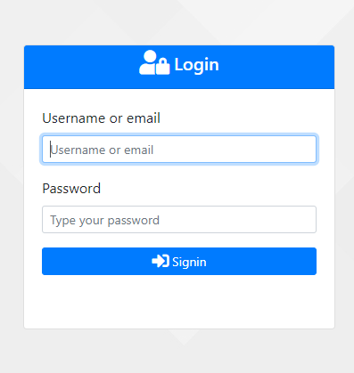
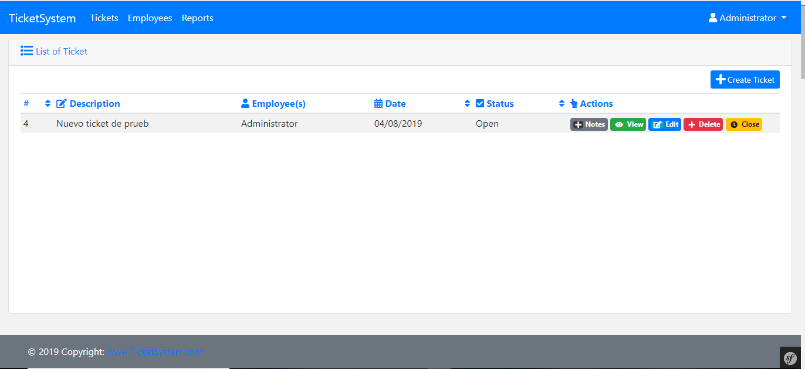
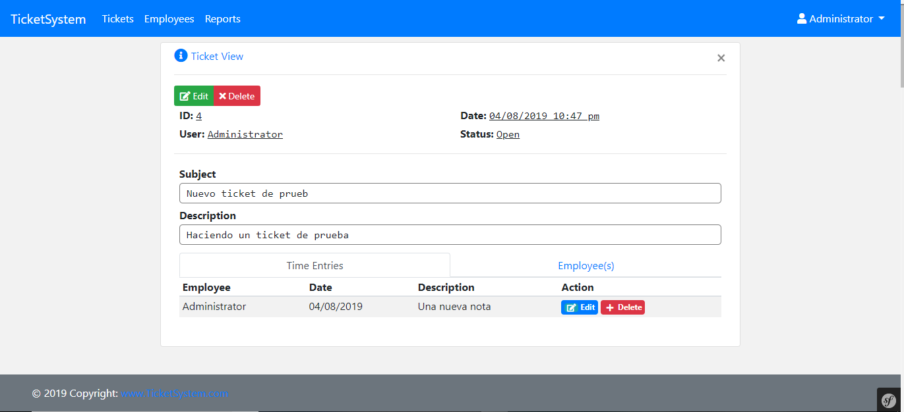
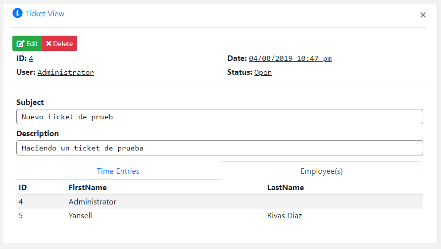
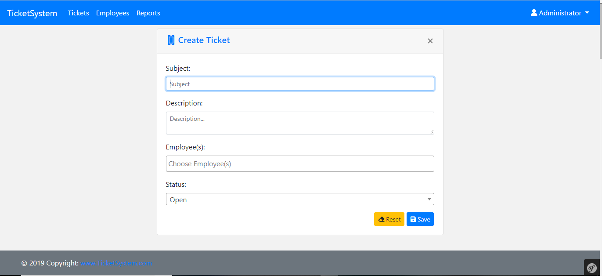
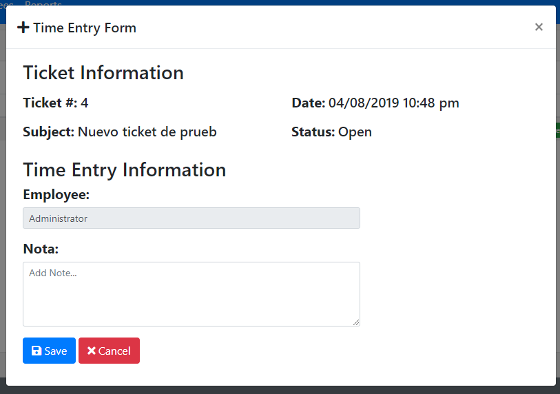
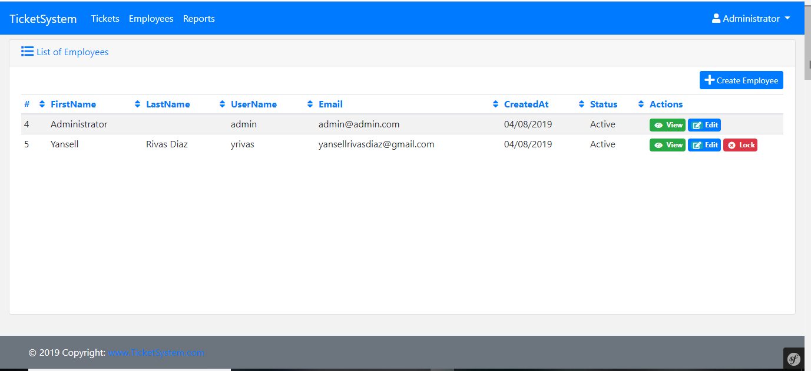
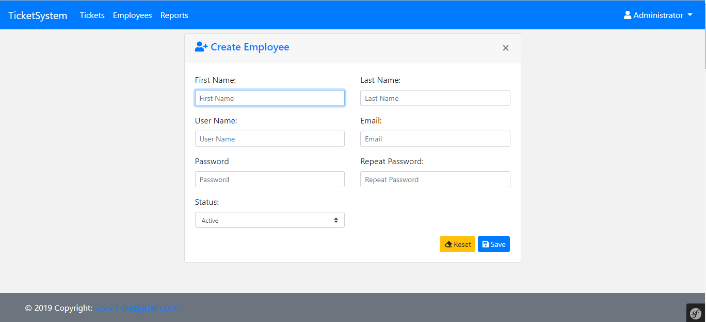
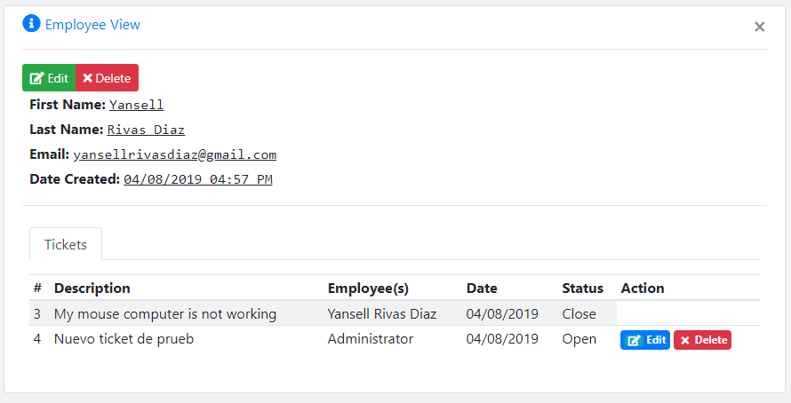
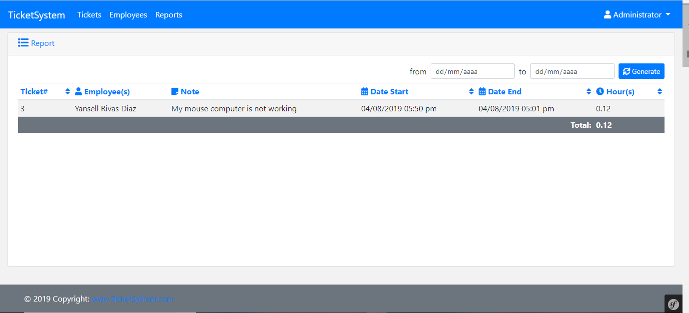

Ticket System Net Tech International
====================================

**Desarrollado por:** ***Yansell Rivas Diaz***

Requerimientos para la instalación:
==================================
    
  * Instalación de un servidor con PHP.
  * Instalación de composer en tu ordenador.
  * Instalación de GIT (Solo si va a clonar el repositorio)
  [link aqui...](https://github.com/yansellrivasdiaz/ticket_system). 
---------------------------------------------------------------
Instalación de la Aplicación:
============================
  
   * Ir mediante la terminar de linux o CMD windows a donde 
   quieras instalar la aplicación web.
   * Clonar el [Repositorio](https://github.com/yansellrivasdiaz/ticket_system) desde github o descargar
   a tu ordenador y descomprimir  en la carpeta donde deseas acceder 
   en modo local.
   * Una vez descargado o clonado debes ejecutar los siguientes comandos:
     
     * **Composer install**
     * **Editar archivo ***app/config/parameters.yml*** 
     y cambiar los parámetros de conexión a la base de datos (***Nota: solo si no agregaste los parametros al momento de ejecutar composer install***) 
     parametros**
     * **php bin/console doctrine:database:create.**
     * **php bin/console doctrine:schema:update --force**
     * **php bin/console doctrine:fixtures:load** ***Nota: una vez ejecute el comando saldrá: Careful, database will bu purged. Do you want to continue? (yes/no) [no]: yes*** y luego darle a enter
     
   * Ahora puedes acceder a la ruta del proyecto ruta:
    127.0.0.1(o Nombre del servidor)/ticket_system.
    
**Nota:** Los datos de accesos al sistema son los siguientes:
    
    * username: admin (Email: admin@admin.com) 
    * Password: admin    

Felicidades si todo salió bien ya puedes empezar a utilizar la App
Ticket System.
---------------------------------------------------------------
**Documentación:**
==================

**1-  Página de login.**

 
Puede loguearse en la aplicación mediante nombre de usuario o email, y la contraseña, en caso del usuario por defecto de la aplicación al momento de instalarlo es: ***username:admin*** & ***password:admin*** 

**2-  Pantalla de inicio (Tickets).**

Esta pantalla mostrará todos los tickets que se encuentran activos y en la misma podrá visualizar ticket, Agregar notas, los tickets creado por el usuario logueado podrán ser editados, borrados y cerrados por el mismo.

**3-  Pantalla de visualizar (Ticket).**

En esta pantalla podrá visualizar ticket y ver la información detallada de los mismos, tanto los ***time entries*** como los ***empleados*** a los que fue asignado el mismo, el usuario logueado podrá borrar las notas si son creadas por el mismo, tiene acceso a borrar el ticket y editarlo.

**Nota:** Los usuarios en esta pantalla solos podrán visualizar los tickets creados por ellos mismos y los tickets a los que son asignados para solucionarlos.

* **3.1-  Pantalla de visualizar (Ticket/Employee(s)).**

**4-  Pantalla para agregar (Ticket).**

En esta pantalla podrá crear nuevos tickets y asignarlos a múltiples empleados, las misma tiene validación de datos tanto back-end como front-end.

**5-  Pantalla time entries form (Ticket).**

En esta pantalla podrá agregar notas a los tickets, tanto el usuario que lo creó como el que está trabajando el ticket, las notas podrán ser eliminadas y editadas por el creador de la misma.

**6-  Pantalla de listado empleados (Employees List).**

En esta pantalla podrán visualizarse los empleados creados, así como puedes activar o desactivar los mismos, desde esta pantalla se accede al formulario de creación de empleados.

**6-  Pantalla de registro empleados (Employees Form).**

En esta pantalla se pueden registrar los empleados, todos los campos de esta son requeridos.

**7-  Pantalla de vista empleado (Employees View).**

En esta pantalla podrá tener una vista previa de un empleado, así como los tickets creados por el mismo y el usuario logueado podrá eliminar los tickets creado por él y editarlos desde esta pantalla.

**8-  Pantalla de reportes(Ticket Reports).**

En esta pantalla podrá generar reportes de tickets donde se presenta un detalla de los mismos del estado y tiempos de resolución de los mismos.

***©copyright 2019 Ing. Yansell Rivas***
